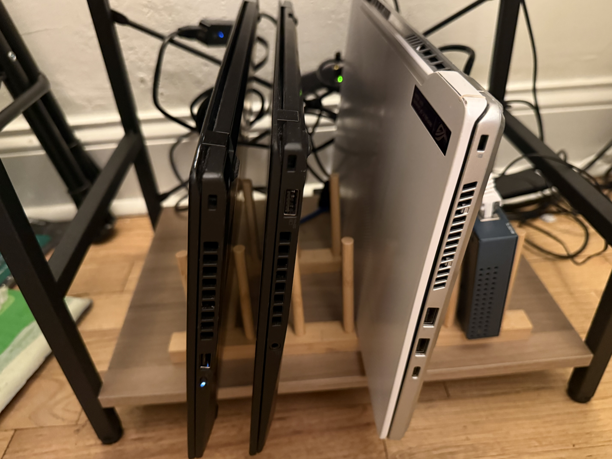

# Hardware

## Homelab

My home cluster uses four older laptops as nodes for the cluster. 

- *Glados*, Lenovo ThinkPad X1 Carbon, 6th Gen (2018)
- *Wheatley*, Lenovo ThinkPad X1 Carbon, 7th Gen (2019)
- *Chell*, Asus Zephyrus G14 (2021)

I removed the batteries from the machines and bought corresponding ethernet adapters to connect them all to a TP-Link Gigabit switch. All machines are running Fedora 42 Server. The lid behavior was modified to modify the flags in `/usr/lib/systemd/logind.conf` to change `HandleLidSwitch=ignore, HandleLidSwitchExternalPower=ignore, HandleLidSwitchDocked=ignore`.

I previously had more computers (an XPS 15 9560) but I found it more annoying to manage; I don't have plans to expand the cluster.

## Laptop Quirks

Zephyrus G14:

- It uses asusctl for managing profiles - by default, it's set to quiet (you'll know if it's not)
- There's an Nvidia RTX 3060 mobile, but it only has access to 8gb of ram (the machine won't boot with a second stick installed, whether it's 8gb or 16gb)
